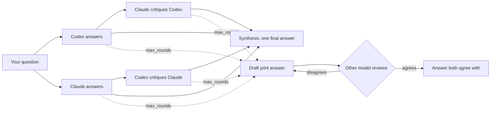

# Codex–Claude Council

[](https://github.com/hamza-aziz-ai/codex-claude-council/actions/workflows/ci.yml)
[](LICENSE)


Ask **ChatGPT (through Codex)** and **Claude** the same question. They answer independently, critique each other, and you get one answer back, using the subscriptions you already have. No API keys.

Works inside **Claude Code**, **Claude Desktop** (Cowork), **Codex**, the **ChatGPT desktop app** and your **terminal**, on Windows, macOS and Linux. You can pick the model and effort for each side, per question.



By default the council makes one pass. Set `max_rounds` and the two models keep drafting and reviewing one joint answer until they both agree with it.

## Requirements

| | |
|---|---|
| [Node.js](https://nodejs.org) 20 or newer | runs the small MCP server (no dependencies) |
| [Claude Code CLI](https://code.claude.com/docs/en/setup), signed in with a Claude Pro, Max, Team or Enterprise plan | `claude auth login` |
| [Codex CLI](https://developers.openai.com/codex/cli), signed in with ChatGPT | `codex login` → *Sign in with ChatGPT* |

Both CLIs are required. The installer checks for them first and stops, with install instructions, if either is missing.

## Install

**macOS / Linux / WSL**

```bash
curl -fsSL https://raw.githubusercontent.com/hamza-aziz-ai/codex-claude-council/main/install.sh | bash
```

**Windows (PowerShell)**

```powershell
irm https://raw.githubusercontent.com/hamza-aziz-ai/codex-claude-council/main/install.ps1 | iex
```

**Any OS with Node.js**

```bash
npx -y github:hamza-aziz-ai/codex-claude-council install
```

The installer:

1. checks Node.js 20+, the Claude Code CLI and the Codex CLI, and reports whether each CLI is signed in;
2. adds the plugin to Claude Code and to Codex from this repository's marketplace;
3. with `--claude-desktop`, also registers the MCP server with Claude Desktop chat.

Options: `--only claude|codex`, `--claude-desktop`, `--dry-run`. With the `curl` installer, put options after `bash -s --`, for example `... | bash -s -- --claude-desktop`.

Restart Claude Code / Codex afterwards.

### Or install per app

**Claude Code**

```bash
claude plugin marketplace add hamza-aziz-ai/codex-claude-council
claude plugin install codex-claude-council@codex-claude-council
```

**Codex** (CLI and IDE extension)

```bash
codex plugin marketplace add hamza-aziz-ai/codex-claude-council
codex plugin add codex-claude-council@codex-claude-council
```

**Claude Desktop** (Cowork and Code)

1. Open **Settings**, and under **Customize** click **Plugins**.
2. Click **+ Add ˅ → Add marketplace → Add from a repository**.
3. Enter `hamza-aziz-ai/codex-claude-council` in the **URL** field.
4. Turn **Sync automatically** on and click **Sync**.
5. Install **codex-claude-council** from the new marketplace.

**ChatGPT desktop app**

1. Open **Settings → Plugins**.
2. Click **Add ˅ → + Add a marketplace**.
3. Enter `https://github.com/hamza-aziz-ai/codex-claude-council.git` in **Source**.
4. Click **Add marketplace**.
5. Install **codex-claude-council** from the new marketplace.

Keep the desktop app open while you use it: the council runs on your computer through your local CLIs, so both still need to be installed and signed in (see [Requirements](#requirements)).

**Claude Desktop, Chat tab** (plugins only load in Cowork and Code): `npx -y github:hamza-aziz-ai/codex-claude-council install --claude-desktop --only claude`, then fully quit and reopen Claude Desktop.

## Use it

Just ask in plain language:

| You say | What runs |
|---|---|
| "Ask the council: should I use Postgres or MongoDB for this?" | `council_ask`: both answer, cross-critique, one final answer |
| "Run a council **debate** on this migration plan." | `debate`: final answer plus both answers, both critiques and the settings used |
| "Get **Codex's** second opinion on this function." | `ask_codex` |
| "Ask **Claude** only, with **sonnet** at **low** effort: …" | `ask_claude` with overrides |
| "Council this with **ChatGPT on gpt-5.6-sol at xhigh** and **Claude on opus at max**: …" | `council_ask` with per-side overrides |
| "Ask the council and **keep going until they agree**: …" | `council_ask` with `max_rounds: 0` |
| "Council debate, **at most 3 rounds** to reach agreement: …" | `debate` with `max_rounds: 3` |
| "Ask the council, and let **ChatGPT write the final answer**: …" | `council_ask` with `synthesizer: "codex"` |

The models run in an empty folder with no tools, so include the code or text you want reviewed in the question. A single-pass council run is five CLI calls. At high effort that can take several minutes, and it counts against both plans' usage limits.

### Who writes the final answer: `synthesizer`

**Claude** writes the final answer by default. Pass `synthesizer: "codex"` (ChatGPT) or `"claude"` for one question, or change the default in your config. In the agreement loop the synthesizer drafts the joint answer and the other model reviews it.

### Until they agree: `max_rounds`

| `max_rounds` | What happens |
|---|---|
| omitted | single pass: answers, critiques, one synthesis (5 calls) |
| `N` (1 or more) | after the critiques, the synthesizer drafts one joint answer and the other model reviews it; repeat for **at most N rounds**, stopping as soon as both agree (4 + 2 per round calls) |
| `0` | the same loop with **no round limit**: it runs until both agree |

The drafter endorses its own draft, so the reviewer's `AGREE` means both models agree with the exact final text. `council_ask` ends with a line saying whether they agreed; `debate` includes every draft and review. If the limit is reached, you get the latest draft and the reviewer's remaining objections. If a call fails partway through (for example a usage limit), you get the latest draft and the reason.

`max_rounds: 0` can run for a long time and use a lot of both plans on questions where reasonable people disagree. You can stop it at any time (Esc / cancel in the app, Ctrl+C in the terminal).

### Model and effort

| Tool | Optional inputs |
|---|---|
| `ask_codex`, `ask_claude` | `model`, `effort` |
| `council_ask`, `debate` | `codex_model`, `codex_effort`, `claude_model`, `claude_effort`, `synthesizer`, `max_rounds` |

- Codex effort: `none`, `minimal`, `low`, `medium`, `high`, `xhigh`
- Claude effort: `low`, `medium`, `high`, `xhigh`, `max`
- Claude models: an alias (`opus`, `sonnet`, `fable`) or a full model name. Codex models: any name your Codex CLI accepts.

Anything you leave out comes from your config.

### From the terminal

```bash
npx -y github:hamza-aziz-ai/codex-claude-council ask "Which is faster for 10M rows, A or B?"
npx -y github:hamza-aziz-ai/codex-claude-council debate "..." --codex-effort xhigh --claude-model opus
npx -y github:hamza-aziz-ai/codex-claude-council ask "..." --max-rounds 0      # until both agree
npx -y github:hamza-aziz-ai/codex-claude-council ask "..." --synthesizer codex  # ChatGPT writes the final answer
npx -y github:hamza-aziz-ai/codex-claude-council codex "..." --effort low
npx -y github:hamza-aziz-ai/codex-claude-council claude "..." --model sonnet --effort max
```

For a shorter command, install it globally with `npm install -g github:hamza-aziz-ai/codex-claude-council` and use `codex-claude-council ask "..."`. Questions can also be piped on stdin.

## Configure

```bash
npx -y github:hamza-aziz-ai/codex-claude-council config --init
```

This creates `~/.codex-claude-council/config.json`. It is re-read on every call, so edits apply immediately:

```json
{
  "timeout_seconds": 600,
  "synthesizer": "claude",
  "allow_api_key_auth": false,
  "codex":  { "command": null, "model": null, "effort": "high" },
  "claude": { "command": null, "model": null, "effort": "high" }
}
```

| Setting | Meaning |
|---|---|
| `timeout_seconds` | limit for each CLI call |
| `synthesizer` | which model writes the final answer: `claude` (default) or `codex` (ChatGPT) |
| `codex.model`, `claude.model` | default model; `null` uses the CLI's own default |
| `codex.effort`, `claude.effort` | default effort |
| `codex.command`, `claude.command` | full path to a CLI if it isn't found automatically |
| `allow_api_key_auth` | `true` allows CLIs signed in with API keys (billed per token) |

Set `COUNCIL_CONFIG` to use a different config file.

## Troubleshooting

Run the doctor. It checks Node.js, both CLIs, their sign-ins and your effective config:

```bash
npx -y github:hamza-aziz-ai/codex-claude-council doctor
```

- **"usage limit"**: your ChatGPT or Claude plan hit its limit. Wait for the reset or lower the effort.
- **"timed out"**: raise `timeout_seconds` or lower the effort.
- **Tools don't appear**: fully quit and reopen the app after installing. In Claude Desktop or the ChatGPT desktop app, check the plugin is installed and enabled under **Settings → Plugins**.
- **`node` not found by a desktop app on macOS**: GUI apps don't read your shell profile, so Node installed with nvm may be invisible to them. Install Node from nodejs.org or Homebrew.
- **CLI not found**: set `codex.command` / `claude.command` to the full path.

## Security and privacy

- Everything runs on your computer. Your question goes to OpenAI and Anthropic through their official CLIs, under your own accounts.
- Codex runs `codex exec` in a **read-only sandbox** in an empty temporary folder, ignoring your `~/.codex/config.toml` (so no plugins, hooks or MCP servers load). Claude runs with **all tools disabled**, no MCP servers, no skills and no user settings. Neither model can read or change your files.
- API-key environment variables are removed before the CLIs start, so calls use your subscriptions rather than per-token API billing. Codex must be signed in with ChatGPT and Claude Code with a Claude subscription unless you set `allow_api_key_auth`.
- A plugin with a local MCP server runs with your user permissions. This one is about 750 lines of dependency-free JavaScript in [`src/`](src); read it before installing if you like.

## Uninstall

```bash
npx -y github:hamza-aziz-ai/codex-claude-council uninstall
```

This removes the plugin from Claude Code and Codex and the Claude Desktop chat entry, and keeps your config file. In Claude Desktop or the ChatGPT desktop app, uninstall it under **Settings → Plugins**.

## Development

```bash
git clone https://github.com/hamza-aziz-ai/codex-claude-council.git
cd codex-claude-council
npm test
```

The tests use fake `codex` / `claude` executables, so they make no model calls. CI runs them on Windows, macOS and Linux.

To try a local checkout, use its path as the marketplace: `claude plugin marketplace add ./codex-claude-council` or `codex plugin marketplace add ./codex-claude-council`.

## Disclaimer

Not affiliated with, or endorsed by, OpenAI or Anthropic. Codex, ChatGPT, Claude and Claude Code are trademarks of their owners. Your use of each CLI is subject to its provider's terms and your plan's limits.

## License

[MIT](LICENSE) © Hamza Aziz
