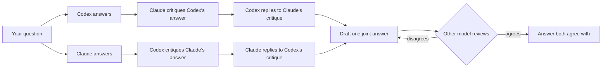

# Codex–Claude Council

[](https://github.com/hamza-aziz-ai/codex-claude-council/actions/workflows/ci.yml)
[](LICENSE)


Ask **ChatGPT (through Codex)** and **Claude** the same question. Each gives its own answer, hears the other's critique of it and replies, and together they settle on one answer that both agree with, using the subscriptions you already have. No API keys.

Works inside **Claude Code**, **Claude Desktop** (Cowork), **Codex**, the **ChatGPT desktop app** and your **terminal**, on Windows, macOS and Linux. You can pick the model and effort for each side, per question.



1. **Answer**: both models answer on their own, without seeing each other.
2. **Critique**: each reviews the other's answer.
3. **Reply**: the critiques are swapped. Each model reads what the other said about its answer and replies: it accepts the points that are right and explains where it still disagrees.
4. **Agree**: one model drafts a joint answer from the whole discussion and the other reviews it. They repeat until both agree (at most 3 rounds by default).

The conversation goes both ways whoever writes the final answer, and from step 2 on each model sees the whole discussion so far.

**Both models work in plan mode.** In a coding session, both models work in your project folder (the `workspace`), with your own Claude Code and Codex setup: your skills, plugins, MCP servers and `CLAUDE.md` / `AGENTS.md`. They can open files, search and run read-only commands such as `git log`, `diff`, `show` and `blame` to check facts about the code, a change, a fix or a log before relying on it. **Neither can change anything:** Claude Code runs in **plan mode**, and Codex, whose command line has no plan mode, runs in its **read-only sandbox**, enforced by the operating system. Proposed changes come back as plans, not edits.

**Both models can search the web.** Codex uses its built-in live web search and Claude uses WebSearch and WebFetch, so they can check current versions, APIs, docs and error messages instead of relying on memory. It is on by default; pass `web_search: false` for one question, `--no-web` in the terminal, or set `"web_search": false` in your config to turn it off.

**Each model keeps one session.** Each side keeps a single Codex / Claude Code session for as long as your host session runs, so it remembers earlier questions, the discussion and what it has already read, instead of reading the project again for every prompt. Each prompt carries only what that model has not seen yet. When you start a new Claude Code or Codex session, the council starts new sessions too.

**Or it continues yours.** If you already have a Claude Code and a Codex session working on a project, give their ids and the council continues those sessions in place, with everything they already know. See [Continue your own sessions](#continue-your-own-sessions).

**Or you take part yourself.** Asked from a Claude Code session, the council can use that very session as its Claude member (and from a Codex session, as its Codex member): the session answers, critiques, replies and drafts in its own conversation, and the plugin runs only the other model. See [Take part yourself](#take-part-yourself-council_join).

## Requirements

| You need | Install | Sign in |
|---|---|---|
| [Node.js](https://nodejs.org) 20 or newer: runs the small MCP server (no dependencies) | [nodejs.org](https://nodejs.org) | – |
| [Claude Code CLI](https://code.claude.com/docs/en/setup), with a Claude Pro, Max, Team or Enterprise plan | macOS / Linux / WSL: `curl -fsSL https://claude.ai/install.sh \| bash`<br>Windows: `irm https://claude.ai/install.ps1 \| iex` | `claude auth login` |
| [Codex CLI](https://developers.openai.com/codex/cli), with a ChatGPT plan | any OS: `npm install -g @openai/codex`<br>macOS: `brew install --cask codex` | `codex login` → *Sign in with ChatGPT* |
| [Git](https://git-scm.com) (recommended) | usually already installed | – |

- **Both CLIs are required.** The installer checks for them first and stops, with these install steps, if either is missing. Every council run also checks that both are signed in before it starts, and stops with the sign-in steps if either is not.
- **Keep both CLIs up to date.** The council uses recent options: Claude Code's plan mode and `stream-json` output, and Codex's `exec resume` and web search. If a run fails with "unknown option" or "unexpected argument", update the CLI it names: `claude update`, or `npm install -g @openai/codex@latest` (or update Codex however you installed it).
- **Git** lets both models look at your project's history, changes and blame, and `skill add` uses it to download a repository's skills. Without it, they can still read the files, and `skill add` installs only a repository's top-level `SKILL.md`.

## Install

**macOS / Linux / WSL**

```bash
curl -fsSL https://raw.githubusercontent.com/hamza-aziz-ai/codex-claude-council/main/install.sh | bash
```

**Windows (PowerShell)**

```powershell
irm https://raw.githubusercontent.com/hamza-aziz-ai/codex-claude-council/main/install.ps1 | iex
```

**Any OS with Node.js**

```bash
npx -y github:hamza-aziz-ai/codex-claude-council install
```

The installer:

1. checks Node.js 20+, the Claude Code CLI and the Codex CLI, and reports whether each CLI is signed in;
2. adds this repository's marketplace to Claude Code and to Codex, and installs the plugin in both (for Claude Code, for your user, so it works in every project);
3. if the plugin is already installed, updates the marketplace and the plugin to the latest version instead;
4. with `--claude-desktop`, also registers the MCP server with Claude Desktop chat.

**Options:** `--only claude|codex` (one app only; both CLIs are still required), `--claude-desktop`, `--dry-run` (show the commands without running them). To pass them:

```bash
curl -fsSL https://raw.githubusercontent.com/hamza-aziz-ai/codex-claude-council/main/install.sh | bash -s -- --claude-desktop
```

```powershell
& ([scriptblock]::Create((irm https://raw.githubusercontent.com/hamza-aziz-ai/codex-claude-council/main/install.ps1))) --claude-desktop
```

```bash
npx -y github:hamza-aziz-ai/codex-claude-council install --claude-desktop
```

**Afterwards:**

1. Fully quit and reopen Claude Code and Codex (and Claude Desktop), so they load the plugin.
2. Check the setup: `npx -y github:hamza-aziz-ai/codex-claude-council doctor`. It checks Node.js, both CLIs, their sign-ins and your config.
3. Try it in a project: *"Ask the council: what does this project do, and what would you improve first?"*

### Update

From the command line, on any OS:

```bash
npx -y github:hamza-aziz-ai/codex-claude-council update
```

It refreshes this repository's marketplace and updates the plugin to the latest version in Claude Code and in Codex. Then fully quit and reopen Claude Code and Codex. `CHANGELOG.md` lists what changed.

```bash
npx -y github:hamza-aziz-ai/codex-claude-council update --only claude   # or --only codex
npx -y github:hamza-aziz-ai/codex-claude-council update --dry-run        # show the commands without running them
codex-claude-council update                                             # if you installed the command globally
```

Running the installer again (the `curl`, `irm` or `npx … install` command above) also updates an installed plugin.

**On Windows, quit Codex and Claude first.** Close every Codex and Claude Code session, IDE extension, and the ChatGPT and Claude desktop apps, then update. A running plugin from version 0.5.1 or earlier keeps its folder in use, and Codex then fails with *"failed to back up plugin cache entry: Access is denied. (os error 5)"*. From 0.5.2 the plugin no longer holds its folder, so later updates work while the apps are open.

To update one app with its own CLI:

```bash
claude plugin marketplace update codex-claude-council
claude plugin update codex-claude-council@codex-claude-council

codex plugin marketplace upgrade codex-claude-council
codex plugin add codex-claude-council@codex-claude-council
```

In Claude Desktop, updates arrive through **Sync automatically**, or click **Sync** on the marketplace under **Settings → Plugins**. In the ChatGPT desktop app, update the plugin under **Settings → Plugins**.

### Or install per app

**Claude Code**

```bash
claude plugin marketplace add hamza-aziz-ai/codex-claude-council
claude plugin install codex-claude-council@codex-claude-council --scope user
```

**Codex** (CLI and IDE extension)

```bash
codex plugin marketplace add hamza-aziz-ai/codex-claude-council
codex plugin add codex-claude-council@codex-claude-council
```

**Claude Desktop** (Cowork and Code)

1. Open **Settings**, and under **Customize** click **Plugins**.
2. Click **+ Add ˅ → Add marketplace → Add from a repository**.
3. Enter `hamza-aziz-ai/codex-claude-council` in the **URL** field.
4. Turn **Sync automatically** on and click **Sync**.
5. Install **codex-claude-council** from the new marketplace.

**ChatGPT desktop app**

1. Open **Settings → Plugins**.
2. Click **Add ˅ → + Add a marketplace**.
3. Enter `https://github.com/hamza-aziz-ai/codex-claude-council.git` in **Source**.
4. Click **Add marketplace**.
5. Install **codex-claude-council** from the new marketplace.

Keep the desktop app open while you use it: the council runs on your computer through your local CLIs, so both still need to be installed and signed in (see [Requirements](#requirements)).

**Claude Desktop, Chat tab** (plugins only load in Cowork and Code): `npx -y github:hamza-aziz-ai/codex-claude-council install --claude-desktop --only claude`, then fully quit and reopen Claude Desktop.

## Use it

Just ask in plain language:

| You say | What runs |
|---|---|
| "Ask the council: should I use Postgres or MongoDB for this?" | `council_ask`: both answer, critique, reply, then agree on one final answer |
| "Run a council **debate** on this migration plan." | `debate`: final answer plus both answers, critiques and replies, every draft/review round and the settings used |
| "Get **Codex's** second opinion on this function." | `ask_codex` |
| "Ask **Claude** only, with **sonnet** at **low** effort: …" | `ask_claude` with overrides |
| "Council this with **ChatGPT on gpt-5.6-sol at xhigh** and **Claude on opus at max**: …" | `council_ask` with per-side overrides |
| "Ask the council and **keep going until they agree**: …" | `council_ask` with `max_rounds: 0` |
| "Council debate, **at most 3 rounds** to reach agreement: …" | `debate` with `max_rounds: 3` |
| "Ask the council, and let **ChatGPT write the final answer**: …" | `council_ask` with `synthesizer: "codex"` |
| "Ask the council: is **the latest** Next.js release safe to upgrade to for our app?" | `council_ask`: both search the web for the release notes and read the project |
| "Get **Codex's** take on this error, and check the library's **current docs**: …" | `ask_codex` with web search (on by default) |
| "Ask the council **without internet access**: …" | `council_ask` with `web_search: false` |
| "Ask the council, **using the llm-council skill**: should we rewrite the billing service or refactor it?" | `council_ask` with `skill: "llm-council"` (an installed skill) |
| "Ask the council **with ponytail**: how should we add retries to the sign-in check?" | `council_ask` with `skill: "ponytail"` |
| "Ask the council, continuing **my Claude session 3f2a…** and **my Codex session 019a…**: is my refactor plan sound?" | `council_ask` with `claude_session_id` and `codex_session_id` |
| "Ask **Codex** in **my session 019a…**: why did the migration test fail?" | `ask_codex` with `session_id` |
| "**Discuss with my Codex session 019a…** whether this refactor is safe" (asked in Claude Code) | `council_join`: this Claude Code session takes part itself, Codex continues session 019a… |

**Long runs.** A council often takes several minutes, and some apps end a tool call after about 60 seconds (Claude Desktop does). So each tool returns within about 50 seconds: with the answer, or with "still working", the current step and a `job_id`. The app then calls `council_result` until the answer is ready (the plugin's skill tells it to), while the council keeps running. `council_cancel` stops a job.

With a `workspace`, the models read what they need from the project themselves; without one, they start in an empty folder, so include the code or text you want reviewed in the question. A council run is six CLI calls (answers, critiques, replies) plus two per agreement round, so eight when the models agree on the first draft. At high effort that can take several minutes, and it counts against both plans' usage limits.

### Web search

Both models can search the web and read web pages (on by default), so questions about anything that changes over time get checked instead of answered from memory. They are asked to prefer primary sources such as official docs, release notes and changelogs, and to say where a fact came from. In the critique and review steps they check each other's claims against those sources too.

Questions where it helps:

- **Current versions and releases:** "Which Python version should a new service target today, and when does 3.11 reach end of life?"
- **APIs and docs that change:** "Is `datetime.utcnow()` deprecated? What should we use instead?"
- **Error messages:** "What causes `ERR_REQUIRE_ESM` after upgrading this package, and what is the fix?"
- **Comparisons and decisions:** "Postgres or DynamoDB for this workload, given current pricing and limits?"

With a `workspace` as well, they combine the two: they read your code, then check it against the current docs.

- "Is our use of the Stripe API in `src/billing` still correct for the current API version?"
- "Our CI started failing after the `actions/checkout` update. Look at `.github/workflows` and the release notes, and tell us why."
- "Which of our dependencies in `package.json` have known security advisories?"

To turn it off: pass `web_search: false` for one question ("ask the council without internet access"), use `--no-web` in the terminal, or set `"web_search": false` in your config. Without web access, both models answer from what they know and from the project, and they are told they have no internet. See [Security and privacy](#security-and-privacy) before using web access together with a sensitive project.

### Skills: `skill`

You can give both council members skills: `SKILL.md` folders with a method or style they can follow. Install a repository's skills once:

```bash
npx -y github:hamza-aziz-ai/codex-claude-council skill add https://github.com/aiwithremy/claude-skills-llm-council
npx -y github:hamza-aziz-ai/codex-claude-council skill add https://github.com/JuliusBrussee/caveman.git
npx -y github:hamza-aziz-ai/codex-claude-council skill add https://github.com/DietrichGebert/ponytail.git
npx -y github:hamza-aziz-ai/codex-claude-council skill add https://github.com/Graphify-Labs/graphify.git
npx -y github:hamza-aziz-ai/codex-claude-council skill list
npx -y github:hamza-aziz-ai/codex-claude-council skill remove caveman-stats
```

`skill add` clones the repository (with `git`) and installs **every skill in it**, each with the files it comes with (references, scripts): caveman brings 20 skills (`caveman`, `caveman-review`, `caveman-compress`, …), ponytail 6 (`ponytail`, `ponytail-review`, `ponytail-audit`, …), graphify and llm-council one each. Where a repository keeps copies of a skill for other tools, the main one is used. It also takes one folder of a repository (`…/tree/<branch>/<folder>`), a local folder or a `SKILL.md` file. Skills are saved in `~/.codex-claude-council/skills/<name>/`. Skills you installed natively for Claude Code (`~/.claude/skills`) or Codex (`~/.codex/skills`, `~/.agents/skills`) can be used by name as well. Restart Claude Code, Codex or the desktop app afterwards so the tools list new skills. Nothing third-party ships with the plugin, so check a skill's license and contents before you install it (llm-council, for example, has no license file).

A skill is used only when you ask for it: "ask the council, using the llm-council skill: …" (the host passes `skill: "llm-council"`), or `--skill llm-council` in the terminal. Both models then get the skill's instructions with the question and **decide for themselves at which steps it is needed**, following the skill's own guidance on when to use it. A method like llm-council is used for a real decision, trade-off or disagreement; a style like caveman (terse replies) or ponytail (the simplest solution that works) says to apply it to every reply. Steps that don't need a skill, such as checking a fact or accepting a point, are answered directly. When a model uses a skill, it follows it fully, including sub-agents (Claude's Agent tool, Codex's multi-agent feature), which work in plan mode / read-only too. The discussion's rules come first: neither model can write files, so steps that would (saving a report, building an index) are skipped, and each answer comes back in the format the step asks for.

**graphify** builds a knowledge graph of your project by running its Python tool and writing `graphify-out/`, which the council cannot do. Build the graph yourself first (`pip install graphifyy`, then `graphify .` in the project), and the council members read `graphify-out/GRAPH_REPORT.md` and `graph.json` from there. Codex can also run `graphify query` in its read-only sandbox; Claude's plan mode allows only commands it knows to be read-only.

A step that uses a skill with sub-agents can take several minutes and uses much more of both plans. Such a call may take up to `skill_timeout_seconds` (default 1800) instead of `timeout_seconds`.

### Continue your own sessions

Say you already have a Claude Code session and a Codex session working on a project, and both know it well. Pass their ids and the council continues **those sessions in place**, instead of starting new ones: each model keeps everything it has read and discussed, and the council's turns are added to that session, so you see them when you go back to it. Both still run in plan mode / read-only for the council, whatever mode you used them in.

| Tool | Inputs | Terminal |
|---|---|---|
| `council_ask`, `debate` | `claude_session_id`, `codex_session_id` (either or both) | `--claude-session <id>`, `--codex-session <id>` |
| `ask_claude`, `ask_codex` | `session_id` | `--session <id>` |

- **Claude Code session id:** the UUID shown by `/status` in the session, or in `claude --resume`.
- **Codex session id:** shown by `/status` in the session, in `codex resume`, and at the end of each session file's name in `~/.codex/sessions/`.

Each session runs in the folder it was started in, and that folder is the `workspace` unless you pass one. The council's turns go into the session, so **close it in its terminal or app first** (or at least don't type in it while the council runs), since two programs writing to one session at once can mix up its history. Don't pass the id of the session you are asking from: to have that session take part, use [`council_join`](#take-part-yourself-council_join).

```bash
npx -y github:hamza-aziz-ai/codex-claude-council ask "Is the plan we discussed for the auth refactor sound?" \
  --claude-session 3f2a9c1e-5b7d-4e8a-9f10-2c3d4e5f6a7b --codex-session 019a3b4c-5d6e-7f80-9a1b-2c3d4e5f6a7b
npx -y github:hamza-aziz-ai/codex-claude-council codex "Why did the migration test fail?" --session 019a3b4c-5d6e-7f80-9a1b-2c3d4e5f6a7b
```

### Who writes the final answer: `synthesizer`

**Claude** drafts the final answer by default and Codex (ChatGPT) reviews it. Pass `synthesizer: "codex"` or `"claude"` for one question, or change the default in your config. Either way both models answer, critique and reply to each other first.

### Until they agree: `max_rounds`

| `max_rounds` | What happens |
|---|---|
| omitted | the configured default: **at most 3 rounds** unless you changed it |
| `N` (1 or more) | the synthesizer drafts one joint answer and the other model reviews it; repeat for **at most N rounds**, stopping as soon as both agree (6 + 2 per round calls) |
| `0` | the same loop with **no round limit**: it runs until both agree |

The drafter endorses its own draft, so the reviewer's `AGREE` means both models agree with the exact final text. The reviewer sees the whole discussion and its own previous objections, so it can check that its points were answered. `council_ask` ends with a line saying whether they agreed; `debate` includes every draft and review. If the limit is reached, you get the latest draft and the reviewer's remaining objections. If a call fails partway through (for example a usage limit), you get the latest draft and the reason.

For the old single pass (the synthesizer writes the final answer alone after the replies, 7 calls, no sign-off from the other model), set `"max_rounds": null` in your config.

`max_rounds: 0` can run for a long time and use a lot of both plans on questions where reasonable people disagree. You can stop it at any time (Esc / cancel in the app, Ctrl+C in the terminal).

### Take part yourself: `council_join`

Say your repository has a Claude Code session `abcd` and a Codex session `efgh`, and you are working in `abcd`. Ask there: "discuss with my Codex session efgh whether we should split the auth module". Then:

- **`abcd` itself is the Claude member.** No second Claude session is started: `abcd` answers, critiques, replies and drafts or reviews in its own conversation, with everything it already knows. `council_join` hands it each turn (the same prompts a Claude member gets), and it sends its reply back with `council_turn`.
- **Codex continues `efgh`** in place, read-only, with everything it knows. Without a session id, Codex starts a new session instead.
- The steps are the same as `council_ask`: both answer independently, critique each other, reply, then draft and review until both agree. The final answer lands in `abcd`.

It works the other way round too: from a Codex session, `council_join` makes that session the Codex member, and Claude continues the Claude Code session you name (or a new one).

| `council_join` input | Meaning |
|---|---|
| `me` | the model the host is: `claude` or `codex` (the host fills it in) |
| `other_session_id` | optional: your session of the other model, continued in place |
| `other_model`, `other_effort` | optional overrides for the other model |
| `synthesizer`, `max_rounds`, `workspace`, `web_search`, `skill` | as for `council_ask` |

Good to know:

- **The host is asked, not forced, to leave files alone.** The other model runs read-only as usual, but your own session keeps whatever permissions you gave it; each turn asks it not to change files while the discussion runs.
- **Close `efgh` or leave it alone while the council runs,** and reopen it afterwards with `codex resume efgh` to see the council's turns there.
- Each of the host's turns may take as long as `skill_timeout_seconds` (default 1800); after that the council stops. `council_cancel` stops it at any time.
- `council_join` needs a host that takes turns (Claude Code, Codex, the desktop apps); it is not available in the terminal commands.

### Model and effort

| Tool | Optional inputs |
|---|---|
| `ask_codex`, `ask_claude` | `model`, `effort`, `workspace`, `web_search`, `skill`, `session_id` |
| `council_ask`, `debate` | `codex_model`, `codex_effort`, `claude_model`, `claude_effort`, `synthesizer`, `max_rounds`, `workspace`, `web_search`, `skill`, `codex_session_id`, `claude_session_id` |
| `council_join` | `me`, `other_session_id`, `other_model`, `other_effort`, `synthesizer`, `max_rounds`, `workspace`, `web_search`, `skill` |

`workspace` is the absolute path of the project folder both models work in (in plan mode, reading but never changing it). In Claude Code and Codex the plugin's skill tells the host to pass the folder you are working in.

- Codex effort: `none`, `minimal`, `low`, `medium`, `high`, `xhigh`
- Claude effort: `low`, `medium`, `high`, `xhigh`, `max`
- Claude models: an alias (`opus`, `sonnet`, `fable`) or a full model name. Codex models: any name your Codex CLI accepts.

Anything you leave out comes from your config.

### From the terminal

```bash
npx -y github:hamza-aziz-ai/codex-claude-council ask "Which is faster for 10M rows, A or B?"
npx -y github:hamza-aziz-ai/codex-claude-council debate "..." --codex-effort xhigh --claude-model opus
npx -y github:hamza-aziz-ai/codex-claude-council ask "..." --max-rounds 0      # until both agree
npx -y github:hamza-aziz-ai/codex-claude-council ask "..." --synthesizer codex  # ChatGPT writes the final answer
npx -y github:hamza-aziz-ai/codex-claude-council codex "..." --effort low
npx -y github:hamza-aziz-ai/codex-claude-council claude "..." --model sonnet --effort max
npx -y github:hamza-aziz-ai/codex-claude-council ask "..." --workspace ~/code/app  # read this project
npx -y github:hamza-aziz-ai/codex-claude-council ask "..." --no-workspace          # no project folder
npx -y github:hamza-aziz-ai/codex-claude-council ask "..." --no-web                # no web search
npx -y github:hamza-aziz-ai/codex-claude-council ask "What changed in the latest Node.js LTS that affects this repo?"  # reads the repo and searches the web
npx -y github:hamza-aziz-ai/codex-claude-council codex "Is datetime.utcnow() deprecated? Check the current Python docs."  # Codex only, with web search
npx -y github:hamza-aziz-ai/codex-claude-council ask "..." --no-web --no-workspace  # neither files nor internet
npx -y github:hamza-aziz-ai/codex-claude-council ask "Rewrite or refactor the billing service?" --skill llm-council  # with an installed skill
npx -y github:hamza-aziz-ai/codex-claude-council claude "How should I add retries here?" --skill ponytail             # the simplest solution
npx -y github:hamza-aziz-ai/codex-claude-council ask "..." --claude-session <uuid> --codex-session <id>             # continue your sessions
```

In the terminal, both models work in the git repository you run the command from (if any) unless you pass `--workspace`, `--no-workspace` or a session id. Each command is a new pair of sessions that lasts for that run, unless you pass session ids.

For a shorter command, install it globally with `npm install -g github:hamza-aziz-ai/codex-claude-council` and use `codex-claude-council ask "..."`. Questions can also be piped on stdin.

## Configure

```bash
npx -y github:hamza-aziz-ai/codex-claude-council config --init
```

This creates `~/.codex-claude-council/config.json`. It is re-read on every call, so edits apply immediately:

```json
{
  "timeout_seconds": 600,
  "skill_timeout_seconds": 1800,
  "tool_wait_seconds": 50,
  "synthesizer": "claude",
  "max_rounds": 3,
  "web_search": true,
  "allow_api_key_auth": false,
  "codex":  { "command": null, "model": null, "effort": "high" },
  "claude": { "command": null, "model": null, "effort": "high" }
}
```

| Setting | Meaning |
|---|---|
| `timeout_seconds` | limit for each CLI call |
| `skill_timeout_seconds` | limit for each CLI call when a skill is in use (default `1800`), as a skill's sub-agents take longer |
| `tool_wait_seconds` | how long one tool call waits before returning "still working" and a `job_id` (default `50`, under the 60-second limit some apps put on tool calls); `0` waits until the answer is ready |
| `synthesizer` | which model writes the final answer: `claude` (default) or `codex` (ChatGPT) |
| `web_search` | whether both models may search the web and read pages: `true` (default) or `false` |
| `max_rounds` | default limit on draft/review rounds: `3` (default), `0` for no limit, `null` for a single pass without agreement |
| `codex.model`, `claude.model` | default model; `null` uses the CLI's own default |
| `codex.effort`, `claude.effort` | default effort |
| `codex.command`, `claude.command` | full path to a CLI if it isn't found automatically |
| `allow_api_key_auth` | `true` allows CLIs signed in with API keys (billed per token) |

Set `COUNCIL_CONFIG` to use a different config file.

## Troubleshooting

Run the doctor. It checks Node.js, both CLIs, their sign-ins and your effective config:

```bash
npx -y github:hamza-aziz-ai/codex-claude-council doctor
```

- **"The council needs both Codex and Claude Code signed in"**: before every council run, both CLIs are checked, and nothing is sent to either model unless both are signed in. The message names each CLI with a problem and the fix: `codex login` (choose *Sign in with ChatGPT*) and/or `claude auth login`.
- **"usage limit"**: your ChatGPT or Claude plan hit its limit. Wait for the reset or lower the effort.
- **"timed out"**: raise `timeout_seconds` or lower the effort.
- **The tool call ended after about 60 seconds** (for example Claude Desktop's bridge limit): update to 0.6.2 or later. Every tool now returns within about 50 seconds, with the answer or with "still working" and a `job_id`; the host then calls `council_result` until the answer is ready, while the council keeps running. If your app has no such limit and you prefer one long call, set `"tool_wait_seconds": 0`.
- **Tools don't appear**: fully quit and reopen the app after installing. In Claude Desktop or the ChatGPT desktop app, check the plugin is installed and enabled under **Settings → Plugins**.
- **`node` not found by a desktop app on macOS**: GUI apps don't read your shell profile, so Node installed with nvm may be invisible to them. Install Node from nodejs.org or Homebrew.
- **CLI not found**: set `codex.command` / `claude.command` to the full path.
- **"unknown option" / "unexpected argument"**: a CLI is too old for the council. Update it: `claude update`, or `npm install -g @openai/codex@latest`.
- **Windows: "Access is denied (os error 5)" when installing or updating**: a running Codex or Claude app still has the plugin's files open. Quit them all (CLI sessions, IDE extensions, the ChatGPT and Claude desktop apps), then run `npx -y github:hamza-aziz-ai/codex-claude-council update` (or the installer) again. See [Update](#update).

## Security and privacy

- Everything runs on your computer. Your question goes to OpenAI and Anthropic through their official CLIs, under your own accounts.
- **Neither model can change your files.** Codex runs `codex exec` in its **read-only sandbox**, enforced by the operating system, with `approval_policy="never"`; these are set on the command line, which overrides your `~/.codex/config.toml` (checked: even a config that grants full access stays read-only). Claude Code runs in **plan mode** (`--permission-mode plan`): it can read, search and run commands Claude Code knows to be read-only, and every edit, write or other command is refused, since nobody is there to approve it. Plan mode is Claude Code's own permission guard, not an operating-system sandbox. The only file it may write is its own plan file under `~/.claude/plans/`.
- **Your own setup.** Both run with your own configuration: your skills, plugins, MCP servers, hooks, `CLAUDE.md` / `AGENTS.md` and permission rules. This plugin itself is switched off inside them, so a member can't start another council. Your MCP servers' tools are available to them; plan mode blocks Claude's non-read-only tools, while Codex follows each server's own approval settings, so keep that in mind for MCP servers that can change things.
- **What they can read.** Whatever either model chooses to read is sent to OpenAI or Anthropic, as when you paste it. Both can read files outside the project too, as they can in your normal sessions: Codex's read-only sandbox allows reading the whole disk, and plan mode allows read-only commands anywhere. Without a `workspace`, they start in an empty folder and are told to work from the question.
- **Web access.** With `web_search` on (the default), Codex's web search runs on OpenAI's side (its sandbox still has no network for commands), and Claude can search and fetch web pages. Your question and what the models read can shape their search queries and the pages they open. With a `workspace` as well, text in the project that tries to instruct the model (a prompt injection) could in principle get it to send project content to a website, for example in a URL it fetches. For sensitive projects, turn web access off with `web_search: false` or `"web_search": false` in your config.
- **Sessions.** The councils' sessions are saved by the CLIs like any other session, so they appear in `claude --resume` and `codex resume` for that folder. A session you pass by id is continued in place: the council's turns are added to it.
- API-key environment variables are removed before the CLIs start, so calls use your subscriptions rather than per-token API billing. Codex must be signed in with ChatGPT and Claude Code with a Claude subscription unless you set `allow_api_key_auth`.
- A plugin with a local MCP server runs with your user permissions. This one is about 1,700 lines of dependency-free JavaScript in [`src/`](src); read it before installing if you like.

## Uninstall

```bash
npx -y github:hamza-aziz-ai/codex-claude-council uninstall
```

This removes the plugin from Claude Code and Codex and the Claude Desktop chat entry, and keeps your config file. In Claude Desktop or the ChatGPT desktop app, uninstall it under **Settings → Plugins**.

## Development

```bash
git clone https://github.com/hamza-aziz-ai/codex-claude-council.git
cd codex-claude-council
npm test
```

The tests use fake `codex` / `claude` executables, so they make no model calls. CI runs them on Windows, macOS and Linux.

To try a local checkout, use its path as the marketplace: `claude plugin marketplace add ./codex-claude-council` or `codex plugin marketplace add ./codex-claude-council`.

## Disclaimer

Not affiliated with, or endorsed by, OpenAI or Anthropic. Codex, ChatGPT, Claude and Claude Code are trademarks of their owners. Your use of each CLI is subject to its provider's terms and your plan's limits.

## License

[MIT](LICENSE) © Hamza Aziz
