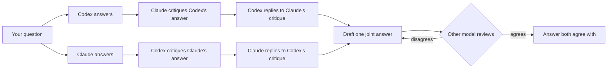

# Codex–Claude Council

[](https://github.com/hamza-aziz-ai/codex-claude-council/actions/workflows/ci.yml)
[](LICENSE)


Ask **ChatGPT (through Codex)** and **Claude** the same question. Each gives its own answer, hears the other's critique of it and replies, and together they settle on one answer that both agree with, using the subscriptions you already have. No API keys.

Works inside **Claude Code**, **Claude Desktop** (Cowork), **Codex**, the **ChatGPT desktop app** and your **terminal**, on Windows, macOS and Linux.

- **Both work in your project, in plan mode.** They read files, search and run read-only commands such as `git log` and `git diff`, but neither can change anything.
- **With your own setup.** Your skills, plugins, MCP servers and `CLAUDE.md` / `AGENTS.md` apply to both.
- **With the sessions you choose.** New sessions, your existing Claude Code and Codex sessions (with everything they already know), or the session you are asking from as one of the two members.
- **With the web.** Both check current versions, APIs and docs instead of relying on memory.
- **With skills on request**, such as [llm-council](https://github.com/aiwithremy/claude-skills-llm-council), [caveman](https://github.com/JuliusBrussee/caveman), [ponytail](https://github.com/DietrichGebert/ponytail) or [graphify](https://github.com/Graphify-Labs/graphify).

**Contents:** [How it works](#how-it-works) · [Requirements](#requirements) · [Install](#install) · [Use it](#use-it) · [Who takes part](#who-takes-part) · [What the members can use](#what-the-members-can-use) · [Options](#options) · [Tool reference](#tool-reference) · [From the terminal](#from-the-terminal) · [Configure](#configure) · [Security and privacy](#security-and-privacy) · [Troubleshooting](#troubleshooting)

## How it works



1. **Answer**: both models answer on their own, without seeing each other.
2. **Critique**: each reviews the other's answer.
3. **Reply**: the critiques are swapped. Each model reads what the other said about its answer and replies: it accepts the points that are right and explains where it still disagrees.
4. **Agree**: one model drafts a joint answer from the whole discussion and the other reviews it. They repeat until both agree (at most 3 rounds by default).

The conversation goes both ways whoever writes the final answer, and from step 2 on each model sees the whole discussion so far. Each model keeps its session between questions, so it remembers the discussion and what it has already read, and each prompt carries only what that model has not seen yet.

## Requirements

| You need | Install | Sign in |
|---|---|---|
| [Node.js](https://nodejs.org) 20 or newer: runs the small MCP server (no dependencies) | [nodejs.org](https://nodejs.org) | – |
| [Claude Code CLI](https://code.claude.com/docs/en/setup), with a Claude Pro, Max, Team or Enterprise plan | macOS / Linux / WSL: `curl -fsSL https://claude.ai/install.sh \| bash`<br>Windows: `irm https://claude.ai/install.ps1 \| iex` | `claude auth login` |
| [Codex CLI](https://developers.openai.com/codex/cli), with a ChatGPT plan | any OS: `npm install -g @openai/codex`<br>macOS: `brew install --cask codex` | `codex login` → *Sign in with ChatGPT* |
| [Git](https://git-scm.com) (recommended) | usually already installed | – |

- **Both CLIs are required.** The installer checks for them and stops, with these install steps, if either is missing. Before each council, the CLIs it runs are checked for a sign-in, and nothing is sent until they are signed in.
- **Keep both CLIs up to date.** The council uses recent options: Claude Code's plan mode and `stream-json` output, and Codex's `exec resume` and web search. If a run fails with "unknown option" or "unexpected argument", update the CLI it names: `claude update`, or `npm install -g @openai/codex@latest`.
- **Git** lets both models look at your project's history, changes and blame, and `skill add` uses it to download a repository's skills.

## Install

**macOS / Linux / WSL**

```bash
curl -fsSL https://raw.githubusercontent.com/hamza-aziz-ai/codex-claude-council/main/install.sh | bash
```

**Windows (PowerShell)**

```powershell
irm https://raw.githubusercontent.com/hamza-aziz-ai/codex-claude-council/main/install.ps1 | iex
```

**Any OS with Node.js**

```bash
npx -y github:hamza-aziz-ai/codex-claude-council install
```

The installer checks Node.js and both CLIs (and whether each is signed in), then adds this repository's marketplace to Claude Code and Codex and installs the plugin in both (for Claude Code, for your user, so it works in every project). If the plugin is already installed, it updates it instead.

**Options:** `--only claude|codex` (one app only; both CLIs are still required), `--claude-desktop` (also register the server with Claude Desktop's Chat tab), `--dry-run` (show the commands without running them). To pass them:

```bash
curl -fsSL https://raw.githubusercontent.com/hamza-aziz-ai/codex-claude-council/main/install.sh | bash -s -- --claude-desktop
```

```powershell
& ([scriptblock]::Create((irm https://raw.githubusercontent.com/hamza-aziz-ai/codex-claude-council/main/install.ps1))) --claude-desktop
```

**Afterwards:**

1. Fully quit and reopen Claude Code and Codex (and Claude Desktop), so they load the plugin.
2. Check the setup: `npx -y github:hamza-aziz-ai/codex-claude-council doctor`.
3. Try it in a project: *"Ask the council: what does this project do, and what would you improve first?"*

### Update

```bash
npx -y github:hamza-aziz-ai/codex-claude-council update               # both apps
npx -y github:hamza-aziz-ai/codex-claude-council update --only claude # or --only codex
npx -y github:hamza-aziz-ai/codex-claude-council update --dry-run     # show the commands only
```

It refreshes the marketplace and updates the plugin in Claude Code and Codex; then fully quit and reopen both. Running the installer again does the same. [`CHANGELOG.md`](CHANGELOG.md) lists what changed. In Claude Desktop, updates arrive through **Sync automatically** (or **Sync** under **Settings → Plugins**); in the ChatGPT desktop app, update the plugin under **Settings → Plugins**.

**Windows:** if Codex fails with *"failed to back up plugin cache entry: Access is denied. (os error 5)"*, a running app still has the plugin's folder open (versions up to 0.5.1 did this). Quit every Codex and Claude session, IDE extension and desktop app, then update again.

### Or install per app

| App | How |
|---|---|
| **Claude Code** | `claude plugin marketplace add hamza-aziz-ai/codex-claude-council`<br>`claude plugin install codex-claude-council@codex-claude-council --scope user` |
| **Codex** (CLI and IDE extension) | `codex plugin marketplace add hamza-aziz-ai/codex-claude-council`<br>`codex plugin add codex-claude-council@codex-claude-council` |
| **Claude Desktop** (Cowork and Code) | **Settings → Customize → Plugins → + Add → Add marketplace → Add from a repository**, enter `hamza-aziz-ai/codex-claude-council`, turn **Sync automatically** on, click **Sync**, then install **codex-claude-council** |
| **Claude Desktop, Chat tab** | `npx -y github:hamza-aziz-ai/codex-claude-council install --claude-desktop --only claude`, then fully quit and reopen Claude Desktop |
| **ChatGPT desktop app** | **Settings → Plugins → Add → + Add a marketplace**, enter `https://github.com/hamza-aziz-ai/codex-claude-council.git` in **Source**, click **Add marketplace**, then install **codex-claude-council** |

Keep the desktop app open while you use it: the council runs on your computer through your local CLIs, so both still need to be installed and signed in.

## Use it

Just ask in plain language. The host (the app you are asking in) picks the tool and fills in its inputs:

| You say | What runs |
|---|---|
| "Ask the council: should I use Postgres or MongoDB for this?" | `council_ask`: both answer, critique, reply, then agree on one final answer |
| "Run a council **debate** on this migration plan." | `debate`: the final answer plus every answer, critique, reply and draft/review round |
| "Get **Codex's** second opinion on this function." | `ask_codex` (or `ask_claude` for Claude alone) |
| "**Discuss with my Codex session 019a…** whether this refactor is safe." (asked in Claude Code) | `council_join`: this session takes part itself; Codex continues session 019a… |
| "Ask the council, continuing **my Claude session 3f2a…** and **my Codex session "auth refactor"**: is my plan sound?" | `council_ask` with `claude_session_id` and `codex_session_id` |
| "Council this with **ChatGPT on gpt-5.6-sol at xhigh** and **Claude on opus at max**: …" | `council_ask` with per-side model and effort |
| "Ask the council and **keep going until they agree**: …" | `council_ask` with `max_rounds: 0` |
| "Ask the council, and let **ChatGPT write the final answer**: …" | `council_ask` with `synthesizer: "codex"` |
| "Ask the council: is **the latest** Next.js release safe to upgrade to for our app?" | `council_ask`: both read the project and search the web |
| "Ask the council **without internet access**: …" | `council_ask` with `web_search: false` |
| "Ask the council, **using the llm-council skill**: rewrite the billing service or refactor it?" | `council_ask` with `skill: "llm-council"` |

In a project, the host passes its folder as the `workspace`, and the models read what they need themselves: point them at files, functions, the failing test or the error rather than pasting whole files. They cannot see the host's conversation (unless the host takes part itself), so the host states the task and any context that is not in the project.

**Long runs.** A council takes several minutes: six CLI calls (answers, critiques, replies) plus two per agreement round, all counting against both plans' limits. Some apps end a tool call after about 60 seconds (Claude Desktop does), so every tool returns within about 50 seconds, with the answer or with "still working", the current step and a `job_id`; the host then calls `council_result` until the answer is ready, while the council keeps running. `council_cancel` stops a job.

## Who takes part

There are three ways to run the two members. The discussion is the same in all of them.

| | Claude member | Codex member | Use it when |
|---|---|---|---|
| **New sessions** (default) | a new Claude Code session | a new Codex session | you want two fresh, independent opinions |
| **Your sessions** | your Claude Code session, continued | your Codex session, continued | both of your sessions already know the work |
| **Take part yourself** | the session you are asking from (if it is Claude Code) | your Codex session, continued, or a new one | you want the session you are in to discuss with the other model |

### New sessions

By default each side runs a new Codex / Claude Code session in the `workspace`, which lasts as long as your host session: follow-up questions reuse it, so the models remember earlier questions and what they read. When you start a new host session, the council starts new sessions too.

### Your sessions

Pass sessions you already have, by id or by name, and the council continues **those sessions in place**, with everything they have read and discussed. The council's turns are added to them, so you see the discussion when you go back.

| Tool | Inputs | Terminal |
|---|---|---|
| `council_ask`, `debate` | `claude_session_id`, `codex_session_id` (either or both) | `--claude-session <id\|name>`, `--codex-session <id\|name>` |
| `ask_claude`, `ask_codex` | `session_id` | `--session <id\|name>` |

**Finding a session's id or giving it a name:**

| | Claude Code | Codex |
|---|---|---|
| **Id** | `/status` in the session (a UUID), or `claude --resume` | `/status` in the session; also the end of its file name in `~/.codex/sessions/YYYY/MM/DD/rollout-…-<id>.jsonl` |
| **Name** | `/rename <name>` in the session | `/rename <name>` in the session |
| **List** | `claude --resume` | `codex resume` (this folder), `codex resume --all` (every folder) |

- A **name** is looked up where each CLI keeps it: Claude Code in the session's own transcript, Codex in `~/.codex/session_index.jsonl`. If several sessions have that name, the most recently used one is taken (an exact match before one that differs only in case). A name can contain spaces: `--codex-session "auth refactor"`.
- Names are easy to reuse by mistake, so pass the id when it matters which session you get.
- Each session runs in the folder it was started in, which is also the default `workspace`. Pass a `workspace` to have it work in another folder.
- For the council's turns, both run in plan mode / read-only, whatever mode you used them in.
- **Close those sessions first**, or at least don't type in them while the council runs: two programs writing to one session can mix up its history. Reopen them afterwards (`claude --resume <id>`, `codex resume <id>`) to see the council's turns.
- Don't pass the id of the session you are asking from; to have that session take part, use `council_join`.

### Take part yourself: `council_join`

Say your repository has a Claude Code session `abcd` and a Codex session `efgh`, and you are working in `abcd`. Ask there: *"discuss with my Codex session efgh whether we should split the auth module"*.

- **`abcd` itself is the Claude member.** No second Claude session is started. `council_join` hands `abcd` each of Claude's turns (the same prompts a Claude member gets); `abcd` writes them in its own conversation, with everything it already knows, and sends each back with `council_turn`.
- **Codex continues `efgh`** in place, read-only. Without a session id, Codex starts a new session.
- The steps are the same as `council_ask`, and the agreed answer lands in `abcd`.

It works the other way round too: from a Codex session, `council_join` makes that session the Codex member, and Claude continues the Claude Code session you name (or a new one).

- **The host is asked, not forced, to leave files alone.** The other model is read-only as usual, but the session you are asking from keeps its own permissions.
- Only the other model's CLI must be signed in.
- Each of the host's turns may take up to `skill_timeout_seconds` (default 1800); after that the council stops. `council_cancel` stops it at any time.
- It needs a host that takes turns (Claude Code, Codex, the desktop apps), so it is not a terminal command.

## What the members can use

| | Claude member (`claude -p`) | Codex member (`codex exec`) | The host, with `council_join` |
|---|---|---|---|
| **Mode** | plan mode | read-only sandbox (Codex's command line has no plan mode) | its own, unchanged |
| **Your setup** | settings, skills, plugins, MCP servers, `CLAUDE.md`, hooks | `config.toml`: skills, plugins, MCP servers, `AGENTS.md`, rules | everything it already has |
| **Can** | read, search, run read-only commands (`git log`, `diff`, `blame`, …), use skills and sub-agents, search the web | read, search, run commands that change nothing, use skills and sub-agents, search the web | anything it normally can; asked not to change files |
| **Cannot** | edit, write or run other commands; ask you questions; use this plugin | write anywhere; get approval for anything; use this plugin | – |

Skills that a step would use to change something (saving a report, building an index) have those steps skipped. Your MCP servers' tools run in their own processes: plan mode refuses Claude's tools that change things, while Codex follows each server's own approval settings. See [Security and privacy](#security-and-privacy).

## Options

### Agreement: `synthesizer` and `max_rounds`

**Claude** drafts the joint answer by default and Codex reviews it; pass `synthesizer: "codex"` (or change it in your config) to swap. Either way both models answer, critique and reply first.

| `max_rounds` | What happens |
|---|---|
| omitted | the configured default: **at most 3 rounds** |
| `N` (1 or more) | draft and review for **at most N rounds**, stopping as soon as both agree |
| `0` | **no round limit**: it runs until both agree (can take long and use a lot of both plans) |

The drafter endorses its own draft, so the reviewer's `AGREE` means both agree with the exact final text. The reviewer sees the whole discussion and its earlier objections, so it can check they were answered. If the limit is reached, you get the latest draft and the remaining objections; if a call fails partway (for example a usage limit), the latest draft and the reason. For a single pass (the synthesizer writes the final answer alone, with no sign-off), set `"max_rounds": null` in your config.

### Web search: `web_search`

Both models can search the web and read pages (on by default): Codex with its live web search, Claude with WebSearch and WebFetch. They prefer primary sources such as official docs and release notes, say where a fact came from, and check each other's claims against them. With a `workspace` they combine the two: *"Is our use of the Stripe API in `src/billing` still correct for the current API version?"*

Turn it off with `web_search: false` for one question ("ask the council without internet access"), `--no-web` in the terminal, or `"web_search": false` in your config. See [Security and privacy](#security-and-privacy) before using it with a sensitive project.

### Skills: `skill`

Skills are `SKILL.md` folders with a method or style the models can follow. Install a repository's skills once:

```bash
npx -y github:hamza-aziz-ai/codex-claude-council skill add https://github.com/aiwithremy/claude-skills-llm-council
npx -y github:hamza-aziz-ai/codex-claude-council skill add https://github.com/JuliusBrussee/caveman.git
npx -y github:hamza-aziz-ai/codex-claude-council skill add https://github.com/DietrichGebert/ponytail.git
npx -y github:hamza-aziz-ai/codex-claude-council skill add https://github.com/Graphify-Labs/graphify.git
npx -y github:hamza-aziz-ai/codex-claude-council skill list
npx -y github:hamza-aziz-ai/codex-claude-council skill remove caveman-stats
```

- `skill add` clones the repository and installs **every skill in it**, each with its files (references, scripts): caveman brings 20 (`caveman`, `caveman-review`, `caveman-compress`, …), ponytail 6 (`ponytail`, `ponytail-review`, …), graphify and llm-council one each. It also takes one folder of a repository (`…/tree/<branch>/<folder>`), a local folder or a `SKILL.md` file. Without git, it installs a repository's top-level `SKILL.md` only.
- Skills are saved in `~/.codex-claude-council/skills/<name>/`. Skills installed natively for Claude Code (`~/.claude/skills`) or Codex (`~/.codex/skills`, `~/.agents/skills`) can be named too. Restart the apps afterwards so the tools list new skills.
- Nothing third-party ships with the plugin: check a skill's license and contents before you install it (llm-council, for example, has no license file).

**A skill is used only when you ask for it**: *"ask the council, using the llm-council skill: …"*, or `--skill llm-council` in the terminal. Both models (and the host, with `council_join`) get its instructions with the question and **decide for themselves at which steps it is needed**, following the skill's own guidance: a method like llm-council for a real decision or disagreement, a style like caveman (terse replies) or ponytail (the simplest solution that works) on every reply. When a model uses a skill, it follows it fully, including sub-agents, which are read-only too. The discussion's rules come first, and each answer comes back in the format its step asks for.

**graphify** builds its knowledge graph by running a Python tool that writes `graphify-out/`, which the members cannot do. Build it yourself first (`pip install graphifyy`, then `graphify .` in the project); the members then read `graphify-out/GRAPH_REPORT.md` and `graph.json`, and Codex can run `graphify query`.

A step that uses a skill with sub-agents can take several minutes and uses much more of both plans; such a call may take up to `skill_timeout_seconds` (default 1800).

## Tool reference

| Tool | Does | Optional inputs (besides `question`) |
|---|---|---|
| `council_ask` | the full council; returns the agreed answer | `codex_model`, `codex_effort`, `claude_model`, `claude_effort`, `synthesizer`, `max_rounds`, `workspace`, `web_search`, `skill`, `codex_session_id`, `claude_session_id` |
| `debate` | the same; returns JSON with every step and the settings | as `council_ask` |
| `ask_codex`, `ask_claude` | one model only | `model`, `effort`, `workspace`, `web_search`, `skill`, `session_id` |
| `council_join` | the host takes part as one member | `me` (required: `claude` or `codex`), `other_session_id`, `other_model`, `other_effort`, `synthesizer`, `max_rounds`, `workspace`, `web_search`, `skill` |
| `council_turn` | sends the host's turn (`council_id`, `text`) | – |
| `council_result` | waits for a running job's answer (or, with `council_join`, the host's next turn) | `job_id` |
| `council_cancel` | stops a running job | `job_id` |

- `workspace`: the absolute path of the project folder both models work in. In Claude Code and Codex, the plugin's skill tells the host to pass the folder you are working in.
- Codex effort: `none`, `minimal`, `low`, `medium`, `high`, `xhigh`. Claude effort: `low`, `medium`, `high`, `xhigh`, `max`.
- Claude models: an alias (`opus`, `sonnet`, `fable`) or a full model name. Codex models: any name your Codex CLI accepts.
- Anything you leave out comes from your [config](#configure).

## From the terminal

```bash
npx -y github:hamza-aziz-ai/codex-claude-council ask "Which is faster for 10M rows, A or B?"
npx -y github:hamza-aziz-ai/codex-claude-council debate "..." --codex-effort xhigh --claude-model opus
npx -y github:hamza-aziz-ai/codex-claude-council ask "..." --max-rounds 0          # until both agree
npx -y github:hamza-aziz-ai/codex-claude-council ask "..." --synthesizer codex     # ChatGPT writes the final answer
npx -y github:hamza-aziz-ai/codex-claude-council codex "..." --effort low          # Codex only
npx -y github:hamza-aziz-ai/codex-claude-council claude "..." --model sonnet       # Claude only
npx -y github:hamza-aziz-ai/codex-claude-council ask "..." --workspace ~/code/app  # this project
npx -y github:hamza-aziz-ai/codex-claude-council ask "..." --no-workspace          # no project folder
npx -y github:hamza-aziz-ai/codex-claude-council ask "..." --no-web                # no web search
npx -y github:hamza-aziz-ai/codex-claude-council ask "..." --skill llm-council     # with an installed skill
npx -y github:hamza-aziz-ai/codex-claude-council ask "..." --claude-session <uuid> --codex-session <id>  # your sessions
npx -y github:hamza-aziz-ai/codex-claude-council codex "..." --session <id>        # your Codex session
```

In the terminal, both models work in the git repository you run the command from (if any), unless you pass `--workspace`, `--no-workspace` or a session id. Each command is a new pair of sessions for that run, unless you pass session ids. Questions can also be piped on stdin. For a shorter command, install it globally (`npm install -g github:hamza-aziz-ai/codex-claude-council`) and use `codex-claude-council ask "..."`.

## Configure

```bash
npx -y github:hamza-aziz-ai/codex-claude-council config --init
```

This creates `~/.codex-claude-council/config.json`. It is re-read on every call, so edits apply immediately:

```json
{
  "timeout_seconds": 600,
  "skill_timeout_seconds": 1800,
  "tool_wait_seconds": 50,
  "synthesizer": "claude",
  "max_rounds": 3,
  "web_search": true,
  "allow_api_key_auth": false,
  "codex":  { "command": null, "model": null, "effort": "high" },
  "claude": { "command": null, "model": null, "effort": "high" }
}
```

| Setting | Meaning |
|---|---|
| `timeout_seconds` | limit for each CLI call |
| `skill_timeout_seconds` | limit for each CLI call when a skill is in use, and for each of the host's turns with `council_join` (default `1800`) |
| `tool_wait_seconds` | how long one tool call waits before returning "still working" and a `job_id` (default `50`, under the 60-second limit some apps have); `0` waits until the answer is ready |
| `synthesizer` | which model drafts the final answer: `claude` (default) or `codex` (ChatGPT) |
| `max_rounds` | draft/review rounds: `3` (default), `0` for no limit, `null` for a single pass without agreement |
| `web_search` | whether the models may search the web and read pages: `true` (default) or `false` |
| `codex.model`, `claude.model` | default model; `null` uses the CLI's own default |
| `codex.effort`, `claude.effort` | default effort |
| `codex.command`, `claude.command` | full path to a CLI if it isn't found automatically |
| `allow_api_key_auth` | `true` allows CLIs signed in with API keys (billed per token) |

Set `COUNCIL_CONFIG` to use a different config file.

## Security and privacy

- **Everything runs on your computer.** Your question goes to OpenAI and Anthropic through their official CLIs, under your own accounts.
- **The members cannot change your files.**
  - Codex runs `codex exec` in its **read-only sandbox**, enforced by the operating system, with `approval_policy="never"`. Both are set on the command line, which overrides your `config.toml`, so even a config that grants full access stays read-only.
  - Claude Code runs in **plan mode**: it reads, searches and runs commands it knows to be read-only, and every edit, write or other command is refused, since nobody is there to approve it. Plan mode is Claude Code's own permission guard, not an operating-system sandbox; the only file it may write is its plan file under `~/.claude/plans/`.
  - With `council_join`, the host is your own session and keeps its own permissions; it is only asked not to change files.
- **Your own setup applies.** The members run with your skills, plugins, MCP servers, hooks, `CLAUDE.md` / `AGENTS.md` and permission rules. This plugin is switched off inside them, so a member can't start another council. MCP tools run in their own processes: plan mode refuses Claude's tools that change things, while Codex follows each server's own approval settings, so keep that in mind for MCP servers that can change things.
- **What they read is sent to the model providers.** Whatever either model chooses to read goes to OpenAI or Anthropic, as when you paste it. Both can read files outside the project too, as in your normal sessions: Codex's read-only sandbox allows reading the whole disk, and plan mode allows read-only commands anywhere. Without a `workspace`, they start in an empty folder and are told to work from the question.
- **Web access.** Codex's web search runs on OpenAI's side (its sandbox still has no network for commands); Claude can search and fetch pages. With a `workspace` as well, text in the project that tries to instruct the model (a prompt injection) could in principle get it to send project content to a website, for example in a URL it fetches. For sensitive projects, turn web access off.
- **Sessions.** The members' sessions are saved by the CLIs like any other, so they appear in `claude --resume` and `codex resume` for that folder. A session you pass by id is continued in place: the council's turns are added to it.
- **Subscriptions, not API keys.** API-key environment variables are removed before the CLIs start. Codex must be signed in with ChatGPT and Claude Code with a Claude subscription, unless you set `allow_api_key_auth`.
- **The plugin itself** runs with your user permissions: about 1,700 lines of dependency-free JavaScript in [`src/`](src). Read it before installing if you like.

## Troubleshooting

Run the doctor. It checks Node.js, both CLIs, their sign-ins and your effective config:

```bash
npx -y github:hamza-aziz-ai/codex-claude-council doctor
```

- **"The council needs … signed in"**: nothing was sent. The message names each CLI with a problem and the fix: `codex login` (choose *Sign in with ChatGPT*) and/or `claude auth login`.
- **"usage limit"**: your ChatGPT or Claude plan hit its limit. Wait for the reset or lower the effort.
- **"timed out"**: raise `timeout_seconds` (or `skill_timeout_seconds` with a skill), or lower the effort.
- **The tool call ended after about 60 seconds**: update to 0.6.2 or later, where every tool returns within about 50 seconds and the host polls `council_result`. If your app has no such limit, `"tool_wait_seconds": 0` waits in one call.
- **"no … session named …"**: no session has that name. Check it with `claude --resume` / `codex resume --all`, rename the session with `/rename`, or pass its id from `/status`.
- **"… is not waiting for your reply now"** (`council_join`): the other model is still working; the host should call `council_result` with the id to get its next turn.
- **`skill "…" is not installed`**: install it with `skill add`, then restart the app so the tools list it.
- **Tools don't appear**: fully quit and reopen the app after installing. In the desktop apps, check the plugin is installed and enabled under **Settings → Plugins**.
- **`node` not found by a desktop app on macOS**: GUI apps don't read your shell profile, so Node installed with nvm may be invisible to them. Install Node from nodejs.org or Homebrew.
- **CLI not found**: set `codex.command` / `claude.command` to the full path.
- **"unknown option" / "unexpected argument"**: a CLI is too old. Update it: `claude update`, or `npm install -g @openai/codex@latest`.
- **Windows: "Access is denied (os error 5)" when installing or updating**: see [Update](#update).

## Uninstall

```bash
npx -y github:hamza-aziz-ai/codex-claude-council uninstall
```

This removes the plugin from Claude Code and Codex and the Claude Desktop chat entry, and keeps your config file and installed skills. In the desktop apps, uninstall it under **Settings → Plugins**.

## Development

```bash
git clone https://github.com/hamza-aziz-ai/codex-claude-council.git
cd codex-claude-council
npm test
```

The tests use fake `codex` / `claude` executables, so they make no model calls. CI runs them on Windows, macOS and Linux. To try a local checkout, use its path as the marketplace: `claude plugin marketplace add ./codex-claude-council` or `codex plugin marketplace add ./codex-claude-council`.

## Disclaimer

Not affiliated with, or endorsed by, OpenAI or Anthropic. Codex, ChatGPT, Claude and Claude Code are trademarks of their owners. Your use of each CLI is subject to its provider's terms and your plan's limits.

## License

[MIT](LICENSE) © Hamza Aziz
